# 🌊Wave Chat

### 🌅Introduction
---
Let me introduce to you my pet-project - Android *Jetpack Compose* Chat App "Wave Chat".
The initial purpose was to learn Jetpack Compose, that's why this app may have lacks of server side. 
In this app, *Firebase* RealtimeDatabase was used as the main data holder. 
It's allowed to quickly exchange message data between users and also helps to implement authentication via Google. 
The Wave Chat app contains several screens, bottom navigation, an app users list, a friends list, and other features that you can read about below.

### 🪂Features
---
* #### **Google authentication**
<table>
    <tr>
        <td>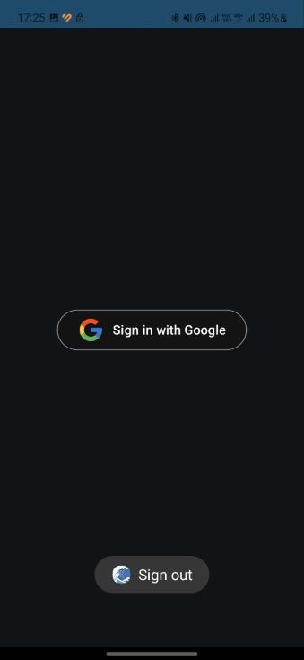</td>
        <td>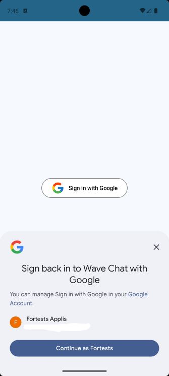</td>
    </tr>
</table>

* #### **en/ru localization, dark/light themes**
<table>
    <tr>
        <td>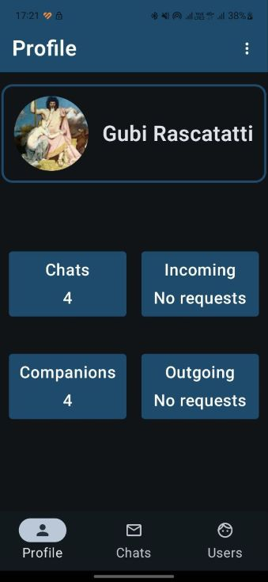</td>
        <td>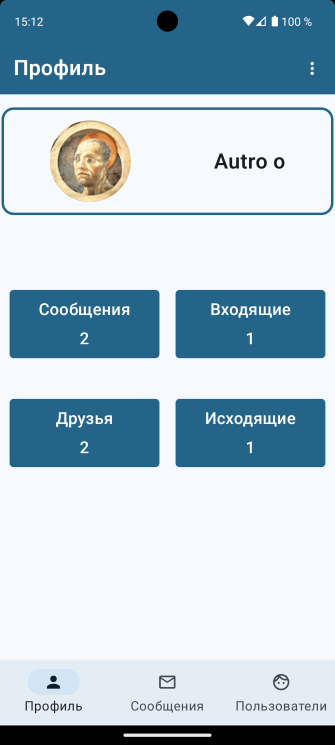</td>
    </tr>
</table>

* #### **Bottom Navigation**
<table>
    <tr>
        <td>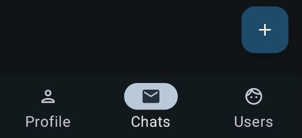</td>
        <td>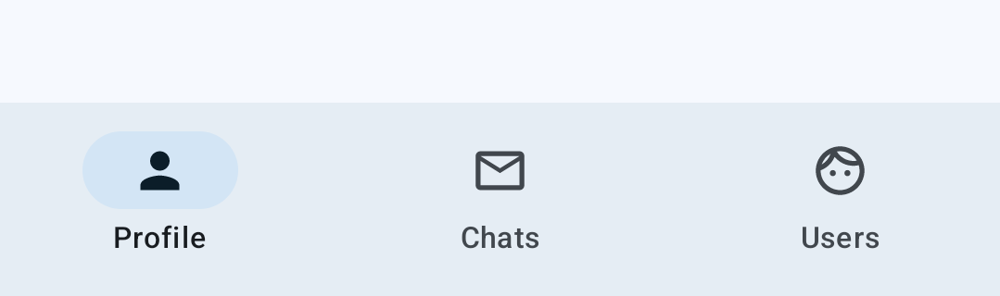</td>
    </tr>
</table>

* #### **Companions list**
small.jpg)
* #### **online/offline user's state tracker, local date & time converter, date header**
.jpg)
* #### **Message searchbar**
<table>
    <tr>
        <td></td>
        <td>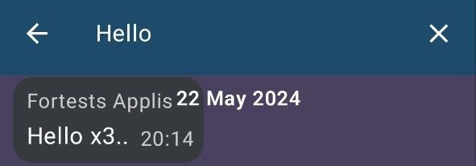</td>
    </tr>
    <tr>
        <td>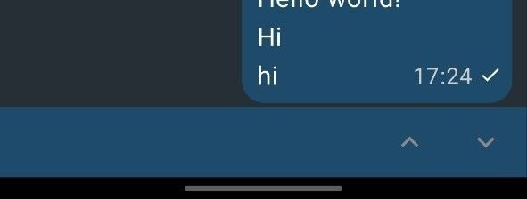</td>
        <td>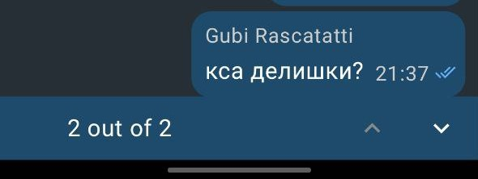</td>
    </tr>
</table>  

* #### **New message marker**
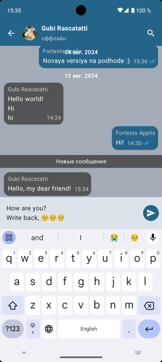
* #### **On message actions**
.jpg)
* #### **All users list**
small.jpg)
* #### **Incoming/Outgoing requests**
<table>
    <tr>
        <td>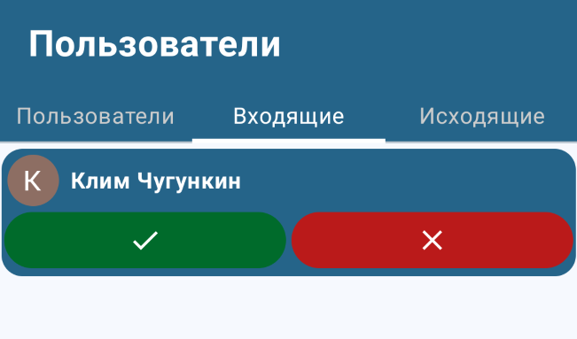</td>
        <td>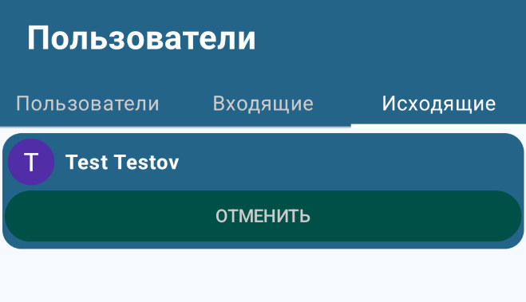</td>
    </tr>
</table>

* #### **Notifications**

### 📙Stack
---
* **Google Authentication**
* **Firebase Auth + Firebase RealtimeDatabase**
* **Hilt Dependency Injection** + **KSP**
* **Jetpack Compose Navigation**
* **Coil for images**
* **ViewModel**
* **Worker**
* **Kotlin Coroutines** + **Flow**

### 🏰Architecture
---

MVVM pattern

|                                          Model                                           |                                                                               View                                                                               |                                                                                         ViewModel                                                                                         |
|:----------------------------------------------------------------------------------------:|:----------------------------------------------------------------------------------------------------------------------------------------------------------------:|:-----------------------------------------------------------------------------------------------------------------------------------------------------------------------------------------:|
| The ***Model*** layer is responsible for the data and business logic of the application. |                          The ***View*** layer is responsible for displaying the UI and handling user interactions via Jetpack Compose.                           |    The ***ViewModel*** layer acts as a bridge between the View and the Model. It holds the UI-related data and business logic, and it is responsible for preparing data for the View.     |
|           **Data Classes**: simple classes that represent the data structure.            |                                       **Composable Functions**: These functions define the UI components and their layout.                                       | **StateFlow**: StateFlow is an observable data holder that allows the View to observe changes in the data. When the data changes, the View is notified and can update itself accordingly. |
|            **Data Sources**: access to remote Firebase RealtimeDatabase data.            | **Handling User Interactions**: The View layer captures user interactions (like button clicks, text input, etc.) and communicates these events to the ViewModel. |                                     **State Management**: The ViewModel manages the UI state, ensuring that the data survives configuration changes.                                      |